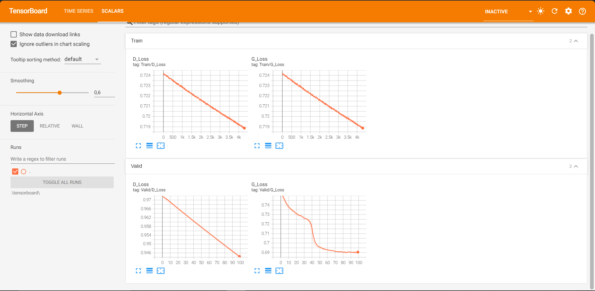
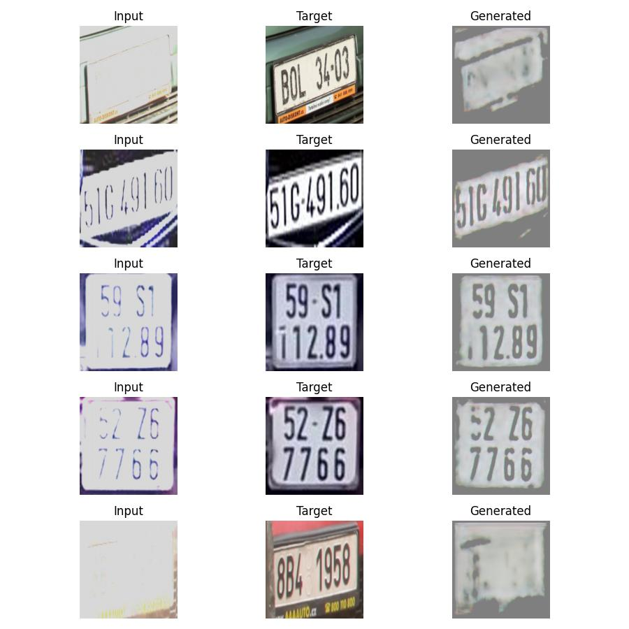
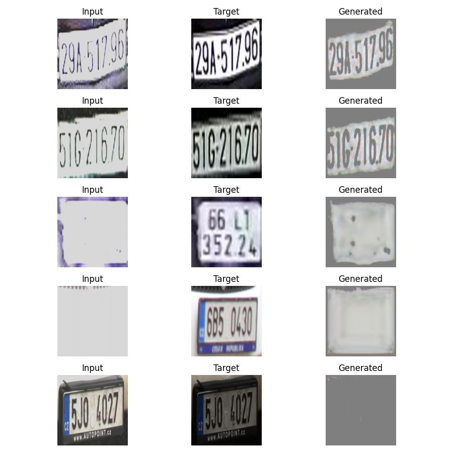
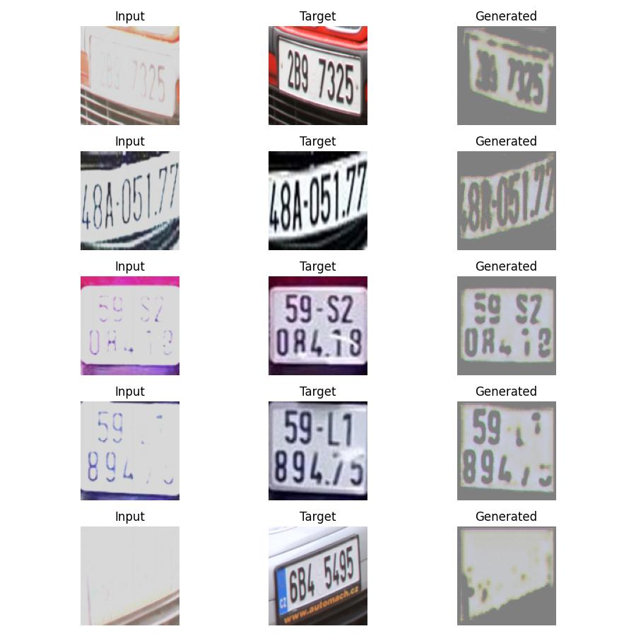

# [PYTORCH] Restoring License Plate Images Affected by Glare Using GANs

## Introduction

Below is my PyTorch implementation for the task of restoring glare-affected images using a GAN network. The Generator is a modified UNET network, while the Discriminator is based on VGG16.
 
## How to use my code

With my code, you can:
* **Train your model from scratch**
* **Train your model with my trained model**
* **Evaluate test images with either my trained model or yours**

## Requirements:

* **python 3.11**
* **pytorch 2.4**
* **opencv (cv2)**
* **tensorboard**
* **tensorboardX** (This library could be skipped if you do not use SummaryWriter)
* **torchvision**
* **PIL**
* **numpy**
* **tqdm**
* **sklearn**

## Datasets:

Statistics of datasets I used for experiments. These datasets could be download from [link](https://drive.google.com/file/d/1-k-8H1owJnijj_1ymGJFxs0UYjfAvogg/view?usp=sharing).

After downloading, put all images in 1 folder **targets**.

| Dataset              | #Images  | 
|----------------------|:--------:|
| License-Plate        |    3188  |

Run the script to generate glare on images,

```
# generate glare from normal images
python glare.py
```
After completion, we will have an **inputs** folder containing 3,188 glare-affected images, and the **targets** folder containing 3,188 normal images. The dataset directory will be organized as follows:
  ```
  License-Plate
  ├── inputs
  ├── targets
  ```
## Setting:

* **Generator**
  * **Model structure**: The generator is based on a UNET network architecture.
  * **Data augmentation**: Input images are resized to 112x112 pixels.
  * **Loss**: 
    * BCE Loss: Used to fool the discriminator into classifying the generated images as real.
    * L1 Loss: Measures the pixel-wise difference between the generated images and the true images, encouraging the generator to produce outputs that closely resemble the target images.
  * **Optimizer**: I used SGD optimizer and my learning rate schedule is 0.0002 and momentum 0.9

* **Discrimminator**
  * **Model structure**: The discriminator is based on the VGG16 network architecture.
  * **Data augmentation**: Used to distinguish between real and generated images, penalizing the discriminator when it incorrectly classifies the images.
  * **Loss**: 
    * BCE Loss: Used to distinguish between real and generated images, penalizing the discriminator when it incorrectly classifies the images.
  * **Optimizer**: I used SGD optimizer and my learning rate schedule is 0.0001 and momentum 0.9

## Trained models

You could find trained model I have trained in [link](https://drive.google.com/drive/folders/1WRsrMlSpE_LkvgyaqDe0rTZx7rjkBs7p?usp=drive_link)

## Training

I provide my pre-trained generator model name **G_best.pt**, and discrimminator name **D_best.pt**. You could put it in the folder **checkpoint/**, and load it before training your new model, for faster convergence.

If you want to train a new model, you could run:
- **python train.py --input_dataset path/to/inputs --target_dataset path/to/targets**: For example, python train.py --input_dataset "License-Plate/inputs" --target_dataset "License-Plate/targets"

**It is important to ensure that the number of validation images is divisible by the batch size.**

## Test

By default, my test script will load the Generator trained model from folder **checkpoint/**. You of course could change it to other folder which contains your trained model(s).

I provide the test scripts as follow:

If you want to test a trained model with one image, you could run:
- **python inference.py -i path/to/input/image**
- For example, python inference.py -i images/license.jpg

If you want to test a trained model with multiple images, you could put all the images in a directory and run:
- **python inference.py -i path/to/input/directory** 
- For example, python inference.py -i images/

## Experiments:

I trained models with GPU P100 on Kaggle for 100 epochs

The training/test loss curves for each experiment are shown below:

- **Loss**


## Results

Some output predictions for experiments are shown below:

      

